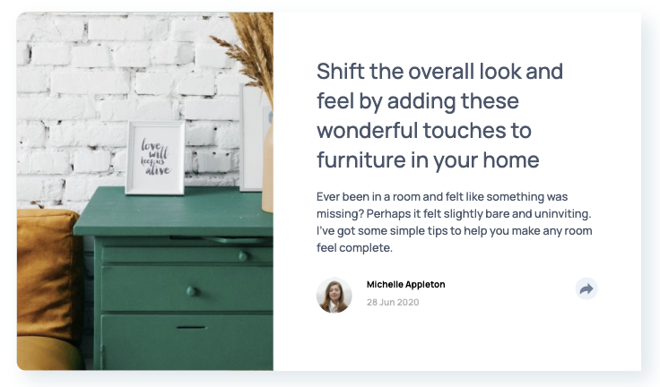

# Frontend Mentor - Article preview component solution

This is a solution to the [Article preview component challenge on Frontend Mentor](https://www.frontendmentor.io/challenges/article-preview-component-dYBN_pYFT). Frontend Mentor challenges help you improve your coding skills by building realistic projects.

## Table of contents

-   [Overview](#overview)
    -   [The challenge](#the-challenge)
    -   [Screenshot](#screenshot)
    -   [Links](#links)
-   [My process](#my-process)

    -   [Built with](#built-with)
    -   [What I learned](#what-i-learned)

-   [Author](#author)
-   [Acknowledgments](#acknowledgments)

## Overview

### The challenge

Users should be able to:

-   View the optimal layout for the component depending on their device's screen size
-   See the social media share links when they click the share icon

### Screenshot



### Links

-   Solution URL: (https://github.com/mistergjones/09-Article-Preview-Component)
-   Live Site URL: (https://mistergjones.github.io/09-Article-Preview-Component/)

## My process

### Built with

-   Semantic HTML5 markup
-   CSS custom properties
-   Flexbox
-   CSS Grid
-   JS (for the Share Icon popups)

### What I learned

The key learning part was the folowing JS code will set a pre-defined HTML code block to "none" (i.e. not be visible) after 1 second.

It was an effective way to close the popup feature.

```js
// after 1 second, reset display back to "none"
setTimeout(() => {
    shareIconThing.style.display = "none";
}, 1000);
```

## Author

-   Website - (https://www.glenjones.com.au)
